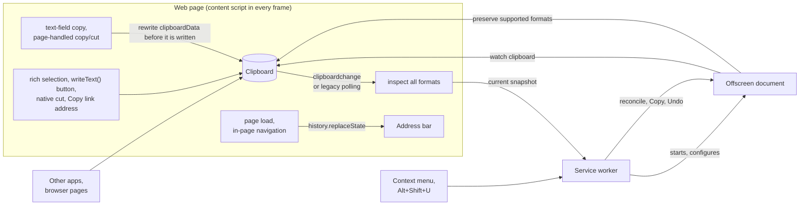

# UTM Randomizer

A Chrome extension that rewrites tracking parameters in copied links and the address bar. Choose [Decoy, Silly, Hybrid, or Remove](#replacement-values) to change what shared links report to analytics. [Processing stays inside your browser](PRIVACY.md).

```text
Copied  https://example.com/article?id=42&utm_source=newsletter&utm_medium=email&utm_campaign=spring_sale&fbclid=IwAR3xYz123AbC456dEf789
Decoy   https://example.com/article?id=42&utm_source=outbrain&utm_medium=notification&utm_campaign=holiday_smb&fbclid=IwAR1hOl802PeN816eVz897
Silly   https://example.com/article?id=42&utm_source=a-very-confused-cat&utm_medium=shouting-really-loud&utm_campaign=operation-click-bait&fbclid=tracking-troll-the-utm-rebellion-in94ro
Hybrid  https://example.com/article?id=42&utm_source=a-very-confused-cat&utm_medium=notification&utm_campaign=operation-click-bait&fbclid=IwAR1hOl802PeN816eVz897
Remove  https://example.com/article?id=42
```

## Install

Build from source with Node 22.13 or later in the 22.x series, or Node 24 or later ([`.nvmrc`](.nvmrc) pins 24):

```bash
git clone https://github.com/pszemraj/utm-randomizer.git
cd utm-randomizer
npm ci
npm run build
```

Open `chrome://extensions`, turn on **Developer mode**, click **Load unpacked**, and select the `dist/` folder. Chrome 123 or newer is required. After rebuilding, reload the extension's card and refresh open web pages so they receive the updated content script.

To verify the installation, copy the example's `Copied` URL from a web page and paste it into a text field. In the default Decoy mode, the tracking values should change while `id=42` stays intact.

## Usage

Copy links the way you normally do; there is nothing to click. Three layers catch them:

- **On web pages**, copy with Ctrl+C / Cmd+C, a site's "Copy link" or "Share" button, or right-click → **Copy link address**. Text fields and iframes are supported; see [copy detection](#page-copies) and [clipboard formats](#clipboard-formats) for the limits.
- **In the address bar**, tracking parameters are replaced without reloading. Copying the address, sharing the tab, bookmarking, and sending it to your phone all pick up the cleaned link.
- **In other apps**, the [background watcher](#background-watching) detects copied links when a focused web page can inspect the clipboard.

Automatic plain-text rewrites show an **Undo** notification on supported web pages when notifications are enabled. Hovering or keyboard focus keeps the notification open; its countdown resumes after both leave. Undo restores the original clipboard text until different contents are observed; a later fresh copy is cleaned again. Copies with HTML or custom formats and address-bar changes have no Undo button.

Explicit actions copy a cleaned link on demand: right-click a link → **Copy link with decoy tracking**; right-click a page → **Copy page link with decoy tracking**; and **Alt+Shift+U** or the popup's **Copy this page's link** button for the current page. These actions use the selected mode and still work while automatic cleaning is paused. The shortcut can be changed at `chrome://extensions/shortcuts`.

The toolbar popup controls the mode, cleaning layers, notifications, and pause setting. Decoy mode, all three automatic cleaning layers, and notifications are enabled by default. Turning off **Watch the whole clipboard** stops background checks; page copy handling stays active. The counters track rewritten clipboard links in total and in the current browser session, excluding address-bar changes. Rich copies include rewritten anchor destinations, counting each link once across its text and HTML representations.

## Replacement values

**Decoy** uses vocabulary and identifier formats from real campaigns:

- sources and mediums from the vocabulary real campaigns use (`bing`, `linkedin`, `newsletter`, `paid_social`, `referral`, ...), including when the original words are percent-encoded or use non-Latin letters;
- campaign names, search terms, and ad placements composed the way marketers write them (`retargeting_2024`, `black_friday_uk_2025`, `best+standing+desk`, `video_15s`);
- identifiers such as click IDs and share tokens rewritten character by character, keeping their exact length, alphabet, issuer prefix, separators, and percent-encoding (`IwAR3xYz...` stays a plausible `IwAR...` value, a 32-character hex `msclkid` stays 32 hex characters, and mixed-case hex keeps each letter's case).

Values are derived from a per-install key, the link, and the value's format. An already-cleaned link stays unchanged when copied or processed again: rewriting is idempotent. Malformed percent sequences such as `%of` stay literal so repeated copies remain stable. The original value contributes its format rather than its contents, so a decoy occasionally matches it, especially for one-character values such as `gad_source=1`. That value is already in its decoy form and stays unchanged.

**Silly** uses obvious nonsense (`utm_source=carrier-pigeon`, click IDs as word salad). **Hybrid** picks a decoy or nonsense separately for each value, so one link can carry a believable click ID next to a joke source; the picks are seeded the same way, so a link keeps its mix. **Remove** deletes the tracking parameters.

## What gets rewritten

Only parameters known to be tracking are touched, in two tiers:

- **Everywhere:** names that only ever mean tracking, such as `utm_*`, `gclid`, `gbraid`, `fbclid`, `msclkid`, `ttclid`, `twclid`, `li_fat_id`, `igsh`, `srsltid`, `gad_source`, `_gl`, Mailchimp's `mc_eid`, HubSpot's `_hsenc` and `__hstc`, Marketo's `mkt_tok`, Matomo's `pk_*` and `mtm_*`, and affiliate click IDs from Impact, CJ, Awin, and Rakuten.
- **On specific sites:** names that are functional elsewhere but tracking on a known site, such as `si` on YouTube and Spotify, `s` and `t` on X, `share_id` on Reddit, `rcm` and `trk*` on LinkedIn, `ref`, `qid`, and `pd_rd_*` on Amazon, `ved` and `ei` on Google Search, and `smid` on The New York Times.

Ambiguous names like `ref`, `source`, `src`, `campaign`, `keywords`, `cid`, and `session_id` are left alone everywhere else, because they carry real meaning on many sites: YouTube searches (`search_query`), LinkedIn job searches (`keywords`), Google Maps places (`cid`), Bing Maps pins and addresses (`sp`), TikTok player display controls (`timestamp`), Amazon store searches (`srs`), and New York Times gift links (`unlocked_article_code`) all keep working. The complete list, with the sources it was curated from, is in [`src/lib/params.ts`](src/lib/params.ts).

Non-tracking query segments, their order and encoding, fragments, and link forms stay byte-for-byte intact. Scheme-less links such as `www.example.com/page?utm_source=x` are supported. Relative links copied by a page, including named paths such as `article?utm_source=email` and asynchronous text and HTML copies, use the originating frame's URL for classification and retain their relative form.

Recognized signed CloudFront, AWS, Google Cloud, and Azure links are left unchanged because changing query bytes can invalidate their signatures. Inputs longer than 100,000 characters are not rewritten. Explicit Copy still copies longer links unchanged and accepts replacements that grow beyond that input bound.

Standalone URLs retain trailing punctuation as part of the URL; sentence-punctuation heuristics apply only to links extracted from prose.

### Clipboard formats

Links inside longer plain text can be cleaned, including standalone Markdown links such as `[article](https://example.com/?utm_source=x)`. Rich copies clean anchor destinations and visible URLs in both plain text and HTML while retaining formatting and functional destinations. New HTML targets are checked even when the plain text is unchanged. Asynchronous automatic writes require a complete inventory containing only plain text and HTML; images, files, and custom formats prevent those writes. During a page-handled copy event, text and HTML can be edited in place without replacing the other formats.

## How it works



### Page copies

Selected text-field copies and data supplied by page copy/cut handlers are rewritten synchronously during event dispatch. Open shadow-root text fields are supported, including on HTTP pages without the async Clipboard API. Native rich selections and native cuts are checked after copying; cuts keep their normal deletion behavior. On [Chrome 144 and later](https://developer.chrome.com/release-notes/144#the-clipboardchange-event), `clipboardchange` catches other writes within 10 seconds of interaction with the page; plain-text changes can include embedded links.

Page clipboard snapshots without rewritable links are not forwarded to the shared writer.

Chrome 123-143 polls after copy and cut events, including events whose propagation the page stops or whose data a later page handler overwrites. Button or link clicks and right-clicks on links also start a pre-gesture clipboard read followed by short polling. Comparing text and HTML against that baseline leaves existing clipboard contents alone after unrelated gestures; polling continues if a new copy interrupts the baseline read. Legacy polling rewrites lone plain-text links and both representations of rich copies. Only trusted browser events authorize these page checks; synthetic copy events and programmatic Undo clicks are ignored. If the async Clipboard API is unavailable, synchronous copy handling still works, but that page cannot inspect asynchronous copies.

The address bar is cleaned with `history.replaceState` once the page's `load` event has fired, so the page has already done its own work with the URL, and again 300 ms after each in-page navigation.

### Clipboard coordination

The offscreen document coordinates all post-copy writes. It remains available while automatic cleaning is enabled, even with whole-clipboard watching off. Pause closes it; explicit copies create it temporarily when needed. Trusted new intent invalidates older reads across pages and frames, including when the new copy has identical text. Settings changes, Undo, and shutdown also cancel pending page reads and worker reconciliation; pause/resume cannot make an older request valid again. The writer checks current text and formats before committing, and Undo succeeds only after acknowledgement. Clipboard read and write operations are not atomic with arbitrary external apps.

### Background watching

The background watcher leaves existing contents alone when starting and checks every 0.75 seconds. Only changed payloads with rewritable text or HTML links are staged for inspection; unrelated contents stay in the offscreen document. After a 250 ms grace period, a focused page uses the Clipboard API to inspect the [format inventory](#clipboard-formats): offscreen synthetic paste alone cannot see web custom formats. Without that inspection, no automatic write occurs. Inspection retries until a reader and supported formats are available, even if a later copy removes a custom format without changing the text. Competing tracked versions of the same link are skipped for 5 seconds after a rewrite.

## Permissions

The [privacy policy](PRIVACY.md) describes data handling, clipboard-access prompts, and the [permissions and their uses](PRIVACY.md#permissions).

## Development

```bash
npm run dev          # rebuild dist/ on every change, then reload the extension card
npm run check        # lint (including required doc comments), format check, typecheck, unit tests
npm run test:e2e     # build, then run Playwright against the real extension in Chromium
npm run playground   # serve the manual test page at http://127.0.0.1:5173
npm run package      # build and zip dist/ into release/utm-randomizer-<version>.zip
npm run icons        # re-render assets/icons/*.png from assets/icon.svg
```

The end-to-end tests load `dist/` into Playwright's Chromium and exercise page copies, background watching, the address bar, format preservation, and Undo. Before the first run, install the browser with `npx playwright install chromium`, or set `CHROMIUM_PATH` to an existing Chromium binary. Run `HEADED=1 npm run test:e2e` to show the browser. The suite runs with native `clipboardchange` events and with that capability removed from a temporary extension copy; a polling-specific case skips the event configuration. Both projects verify the capability in the content script's isolated world. This exercises the fallback in current Chromium, not an older Chrome installation. See the [validation requirements](CONTRIBUTING.md#checks) when choosing local checks.

The playground has one control for each copy path, a tracked address-bar link, a link to copy from another app, right-click test links, functional links that must paste unchanged, an iframe, and a box to inspect pasted text. Open it in the browser where `dist/` is loaded.

CI runs the checks, the end-to-end tests, and packaging on every pull request, and attaches the Web Store zip to the run. See [CONTRIBUTING.md](CONTRIBUTING.md) for adding parameters and replacement values and for submitting changes.

### Source map

| Path                             | Contents                                                                             |
| -------------------------------- | ------------------------------------------------------------------------------------ |
| `src/manifest.json`              | Extension manifest; the build fills in `version` from `package.json`                 |
| `src/content.ts`                 | Content script entry: settings, copy watcher, address bar, notifications             |
| `src/background.ts`              | Service worker: context menu, shortcut, statistics, key, clipboard watcher lifecycle |
| `src/offscreen.ts`               | Background clipboard watcher and clipboard writer                                    |
| `src/popup.*`                    | Toolbar popup                                                                        |
| `src/lib/params.ts`              | Tracking-parameter rules, global and per site                                        |
| `src/lib/rewrite.ts`             | In-place link and text rewriting                                                     |
| `src/lib/values.ts`, `prng.ts`   | Decoy, silly, and hybrid replacement values, seeded per install                      |
| `src/lib/copy-watcher.ts`        | Copy detection on pages: copy events, `clipboardchange`, polling fallback            |
| `src/lib/clipboard-html.ts`      | Rich clipboard rewriting and link counting                                           |
| `src/lib/address-bar.ts`         | Address-bar cleaning                                                                 |
| `src/lib/toast.ts`               | On-page notification in a shadow root on the top layer                               |
| `src/lib/messages.ts`            | Runtime message contracts and sender checks                                          |
| `src/lib/settings.ts`            | Settings defaults, storage subscriptions, and per-install key requests               |
| `tests/unit/`                    | Vitest: rules, rewriting, values, and the page watchers in a simulated DOM           |
| `tests/e2e/`                     | Playwright tests with the extension loaded                                           |
| `tests/fixtures/playground.html` | Manual and end-to-end test page                                                      |
| `scripts/`                       | Build, packaging, playground server, icon renderer                                   |

## License

MIT
