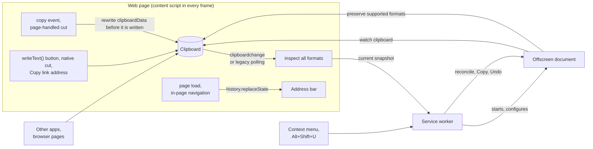

# UTM Randomizer

A Chrome extension that rewrites tracking parameters in copied links and the address bar. Choose [Decoy, Silly, Hybrid, or Remove](#replacement-values) to change what shared links report to analytics. [Processing stays inside your browser](PRIVACY.md).

```text
Copied  https://example.com/article?id=42&utm_source=newsletter&utm_medium=email&utm_campaign=spring_sale&fbclid=IwAR3xYz123AbC456dEf789
Decoy   https://example.com/article?id=42&utm_source=outbrain&utm_medium=notification&utm_campaign=holiday_smb&fbclid=IwAR1hOl802PeN816eVz897
Silly   https://example.com/article?id=42&utm_source=a-very-confused-cat&utm_medium=shouting-really-loud&utm_campaign=operation-click-bait&fbclid=tracking-troll-the-utm-rebellion-in94ro
Hybrid  https://example.com/article?id=42&utm_source=a-very-confused-cat&utm_medium=notification&utm_campaign=operation-click-bait&fbclid=IwAR1hOl802PeN816eVz897
Remove  https://example.com/article?id=42
```

## Install

Build from source with Node 22.13 or later in the 22.x series, or Node 24 or later ([`.nvmrc`](.nvmrc) pins 24):

```bash
git clone https://github.com/pszemraj/utm-randomizer.git
cd utm-randomizer
npm ci
npm run build
```

Open `chrome://extensions`, turn on **Developer mode**, click **Load unpacked**, and select the `dist/` folder. Chrome 123 or newer is required. After pulling changes, rebuild and click the reload icon on the extension's card.

To verify the installation, copy the example's `Copied` URL from a web page and paste it into a text field. In the default Decoy mode, the tracking values should change while `id=42` stays intact.

## Usage

Copy links the way you normally do; there is nothing to click. Three layers catch them:

- **On web pages**, copy detection covers selecting a link and pressing Ctrl+C / Cmd+C (including in text fields), a site's "Copy link" or "Share" button (using `navigator.clipboard`, `execCommand('copy')`, or a copy-event handler, including inside iframes), and right-click → **Copy link address**.
- **In the address bar**, tracking parameters are replaced without reloading. Copying the address, sharing the tab, bookmarking, and sending it to your phone all pick up the cleaned link.
- **In other apps**, a background watcher detects copies and asks a focused web page to inspect all clipboard formats before rewriting. If no focused page can inspect them, the clipboard is left untouched until one is available.

Automatic plain-text rewrites show an **Undo** notification on supported web pages when notifications are enabled. Undo restores the original clipboard text until different contents are observed; a later fresh copy is cleaned again. HTML rewrites and address-bar changes have no Undo button.

Explicit actions copy a cleaned link on demand: right-click a link → **Copy link with decoy tracking**; right-click a page → **Copy page link with decoy tracking**; and **Alt+Shift+U** or the popup's **Copy this page's link** button for the current page. These actions use the selected mode and still work while automatic cleaning is paused. The shortcut can be changed at `chrome://extensions/shortcuts`.

The toolbar popup controls the mode, cleaning layers, notifications, and pause setting. Automatic cleaning and notifications are enabled by default. Turning off **Watch the whole clipboard** stops background checks; page copy handling stays active. The counters track rewritten clipboard links in total and in the current browser session, excluding address-bar changes.

## Replacement values

**Decoy** (the default) uses vocabulary and identifier formats from real campaigns:

- sources and mediums from the vocabulary real campaigns use (`bing`, `linkedin`, `newsletter`, `paid_social`, `referral`, ...), including when the original words are percent-encoded or use non-Latin letters;
- campaign names, search terms, and ad placements composed the way marketers write them (`retargeting_2024`, `black_friday_uk_2025`, `best+standing+desk`, `video_15s`);
- identifiers such as click IDs and share tokens rewritten character by character, keeping their exact length, alphabet, issuer prefix, separators, and percent-encoding (`IwAR3xYz...` stays a plausible `IwAR...` value, a 32-character hex `msclkid` stays 32 hex characters, and mixed-case hex keeps each letter's case).

Values are derived from a per-install key, the link, and the value's format. An already-cleaned link stays unchanged when copied or processed again: rewriting is idempotent. Malformed percent sequences such as `%of` stay literal so repeated copies remain stable. The original value contributes its format rather than its contents, so a decoy occasionally matches it, especially for one-character values such as `gad_source=1`. That value is already in its decoy form and stays unchanged.

**Silly** uses obvious nonsense (`utm_source=carrier-pigeon`, click IDs as word salad). **Hybrid** picks a decoy or nonsense separately for each value, so one link can carry a believable click ID next to a joke source; the picks are seeded the same way, so a link keeps its mix. **Remove** deletes the tracking parameters.

## What gets rewritten

Only parameters known to be tracking are touched, in two tiers:

- **Everywhere:** names that only ever mean tracking, such as `utm_*`, `gclid`, `gbraid`, `fbclid`, `msclkid`, `ttclid`, `twclid`, `li_fat_id`, `igsh`, `srsltid`, `gad_source`, `_gl`, Mailchimp's `mc_eid`, HubSpot's `_hsenc` and `__hstc`, Marketo's `mkt_tok`, Matomo's `pk_*` and `mtm_*`, and affiliate click IDs from Impact, CJ, Awin, and Rakuten.
- **On specific sites:** names that are functional elsewhere but tracking on a known site, such as `si` on YouTube and Spotify, `s` and `t` on X, `share_id` on Reddit, `rcm` and `trk*` on LinkedIn, `ref`, `qid`, and `pd_rd_*` on Amazon, `ved` and `ei` on Google Search, and `smid` on The New York Times.

Ambiguous names like `ref`, `source`, `src`, `campaign`, `keywords`, `cid`, and `session_id` are left alone everywhere else, because they carry real meaning on many sites: YouTube searches (`search_query`), LinkedIn job searches (`keywords`), Google Maps places (`cid`), and New York Times gift links (`unlocked_article_code`) all keep working. The complete list, with the sources it was curated from, is in [`src/lib/params.ts`](src/lib/params.ts).

Non-tracking query segments, their order and encoding, fragments, and link forms stay byte-for-byte intact. Scheme-less links such as `www.example.com/page?utm_source=x` are supported. Relative links copied by a page, including asynchronous text and HTML copies, use the originating frame's URL for classification and retain their relative form.

Recognized signed CloudFront, AWS, Google Cloud, and Azure links are left unchanged because changing query bytes can invalidate their signatures. Inputs longer than 100,000 characters are not rewritten.

Links inside longer plain text can be cleaned, including standalone Markdown links such as `[article](https://example.com/?utm_source=x)`. When a copy supplies HTML, link targets and visible URLs are cleaned while preserving the HTML flavor, including new targets with unchanged plain text. Polling compares both flavors to leave existing rich clipboard contents alone after unrelated clicks, and continues if a new copy interrupts its baseline read. Automatic writes require a complete inventory containing only plain text and HTML; images, files, and custom formats are left untouched. Standalone URLs retain trailing punctuation as part of the URL; sentence-punctuation heuristics apply only to links extracted from prose.

## How it works



Copy events and page-handled cuts are rewritten synchronously after the page's handlers have run. Native cuts keep their normal deletion behavior and are checked asynchronously. On [Chrome 144 and later](https://developer.chrome.com/release-notes/144#the-clipboardchange-event), `clipboardchange` catches other writes within 10 seconds of interaction with the page; plain-text changes can include embedded links.

Chrome 123–143 polls after copy and cut events, including events whose propagation the page stops. Button or link clicks and right-clicks on links also start a pre-gesture clipboard read followed by short polling. Comparing against that baseline leaves existing clipboard text alone after unrelated gestures. Legacy polling rewrites lone links and HTML targets. Only trusted browser events authorize these page checks; synthetic copy events and programmatic Undo clicks are ignored. If the async Clipboard API is unavailable, synchronous copy handling still works, but that page cannot inspect asynchronous copies.

The address bar is cleaned with `history.replaceState` once the page's `load` event has fired, so the page has already done its own work with the URL, and again 300 ms after each in-page navigation.

The offscreen document coordinates all post-copy writes, including explicit Copy and Undo. Page reads are invalidated by newer events, settings changes, Undo, and shutdown. The writer checks current text and formats before committing, and Undo succeeds only after acknowledgement. Clipboard read and write operations are not atomic with arbitrary external apps.

The background watcher leaves existing contents alone when starting, checks every 0.75 seconds, and waits 250 ms after detecting a change. A focused page then uses the Clipboard API to inspect the complete format inventory: offscreen synthetic paste alone cannot see web custom formats. Without that inspection, no automatic write occurs. Turning off whole-clipboard watching stops polling; the shared writer remains available for page copies and Undo. Competing tracked versions of the same link are skipped for 5 seconds after a rewrite.

## Permissions

The [privacy policy](PRIVACY.md) describes data handling and lists the [permissions and their uses](PRIVACY.md#permissions). Background watching can cause system clipboard-access prompts; turning it off stops those background reads.

## Development

```bash
npm run dev          # rebuild dist/ on every change, then reload the extension card
npm run check        # lint (including required doc comments), format check, typecheck, unit tests
npm run test:e2e     # build, then run Playwright against the real extension in Chromium
npm run playground   # serve the manual test page at http://127.0.0.1:5173
npm run package      # build and zip dist/ into release/utm-randomizer-<version>.zip
npm run icons        # re-render assets/icons/*.png from assets/icon.svg
```

The end-to-end tests load `dist/` into Playwright's Chromium, copy links on a local test page through every path listed above, copy links from outside the page to exercise the background watcher, check the address bar, and read the clipboard back, including checks that the clipboard stays stable (no watcher ping-pong) and that Undo sticks. Before the first run, install the browser with `npx playwright install chromium`, or set `CHROMIUM_PATH` to an existing Chromium binary. `HEADED=1` shows the browser while the tests run. Each test runs twice: with native `clipboardchange` events and with the event capability removed from a temporary extension copy to exercise polling. Both projects verify the capability in the content script's isolated world.

The playground has one control for each copy path, a tracked address-bar link, a link to copy from another app, right-click test links, functional links that must paste unchanged, an iframe, and a box to inspect pasted text. Open it in the browser where `dist/` is loaded.

| Path                             | Contents                                                                             |
| -------------------------------- | ------------------------------------------------------------------------------------ |
| `src/manifest.json`              | Extension manifest; the build fills in `version` from `package.json`                 |
| `src/content.ts`                 | Content script entry: settings, copy watcher, address bar, notifications             |
| `src/background.ts`              | Service worker: context menu, shortcut, statistics, key, clipboard watcher lifecycle |
| `src/offscreen.ts`               | Background clipboard watcher and clipboard writer                                    |
| `src/popup.*`                    | Toolbar popup                                                                        |
| `src/lib/params.ts`              | Tracking-parameter rules, global and per site                                        |
| `src/lib/rewrite.ts`             | In-place link and text rewriting                                                     |
| `src/lib/values.ts`, `prng.ts`   | Decoy, silly, and hybrid replacement values, seeded per install                      |
| `src/lib/copy-watcher.ts`        | Copy detection on pages: copy events, `clipboardchange`, polling fallback            |
| `src/lib/address-bar.ts`         | Address-bar cleaning                                                                 |
| `src/lib/toast.ts`               | On-page notification in a shadow root on the top layer                               |
| `tests/unit/`                    | Vitest: rules, rewriting, values, and the page watchers in a simulated DOM           |
| `tests/e2e/`                     | Playwright tests with the extension loaded                                           |
| `tests/fixtures/playground.html` | Manual and end-to-end test page                                                      |
| `scripts/`                       | Build, packaging, playground server, icon renderer                                   |

CI runs the checks, the end-to-end tests, and packaging on every pull request, and attaches the Web Store zip to the run. See [CONTRIBUTING.md](CONTRIBUTING.md) for adding parameters and replacement values and for submitting changes.

## License

MIT
