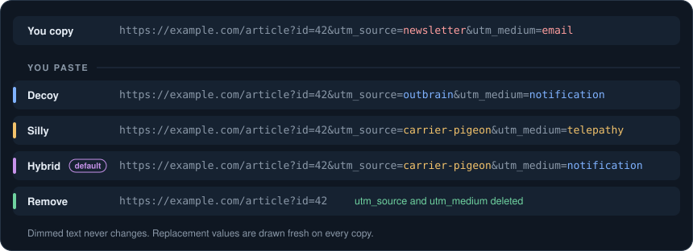

# UTM Randomizer

A Chrome extension that replaces tracking parameters in copied URLs with believable decoys, nonsense, or nothing. Page addresses stay unchanged. [Everything stays in your browser](PRIVACY.md).



UTM and other supported campaign fields and ad click IDs are rewritten. Ambiguous and site-specific fields stay untouched. See [supported parameters and limits](docs/behavior.md#what-gets-rewritten) and [mode details](docs/behavior.md#replacement-values).

## Install

Requires Chrome 123 or newer.

1. Open the [latest release](https://github.com/pszemraj/utm-randomizer/releases/latest). If its **Assets** include `utm-randomizer-<version>.zip`, download that file. Tagged releases build this asset automatically. GitHub's automatically generated **Source code** archives are not built extensions; older releases without the project ZIP require the [source build](#build-from-source) instead.
2. Unzip the project ZIP into a permanent folder, such as `Documents/ChromeExtensions/utm-randomizer/`. Keep that folder in place; Chrome loads the extension's files from it.
3. Open `chrome://extensions` and turn on **Developer mode** in the top-right corner.
4. Click **Load unpacked** and select the extracted folder containing `manifest.json`.

If you previously loaded 1.2.0 from the repository root, note whether cleaning is enabled, remove that extension entry, then load the 2.x release folder or `dist/` and restore your choice. Chrome derives an unpacked extension's identity from its folder, so moving from the repository root creates a fresh installation with default settings. Do not leave both versions loaded.

## Usage

- Copy a URL or a compact share snippet while Chrome is focused: Ctrl+C / Cmd+C, a site's copy button, or **Copy link address**. Supported links inside short captions are cleaned; long prose-dominated documents stay unchanged.
- To change the mode or turn cleaning off, open `chrome://extensions`, find **UTM Randomizer**, and select **Details** -> **Extension options**.
- Cleaning and **Hybrid** mode are enabled by default. Rewritten URLs are plain text. A successful rewrite briefly shows a green check on the extension icon with the title **Your link was randomized.** There are no system notifications, toolbar popup, or keyboard shortcuts.

Try it: right-click [this test link](https://example.com/article?id=42&utm_source=newsletter&utm_medium=email), select **Copy link address**, and paste into a text field. The tracking values should change while `id=42` stays intact.

## Build from source

Use Node 22.13 or later in the 22.x series, or Node 24 or later ([`.nvmrc`](.nvmrc) pins 24):

```bash
git clone https://github.com/pszemraj/utm-randomizer.git
cd utm-randomizer
npm ci
npm run build
```

Follow the Chrome steps above, selecting `dist/` instead of an extracted release folder. Verify it with the test link under [Usage](#usage). After rebuilding, reload the extension in `chrome://extensions`.

## Development

Run `npm run dev` to rebuild on edits and `npm run check` for lint, formatting, types, and unit tests. See [development commands and browser tests](docs/development.md), [behavior and clipboard details](docs/behavior.md), and [contributing](CONTRIBUTING.md).

[](https://deepwiki.com/pszemraj/utm-randomizer)

## License

MIT
