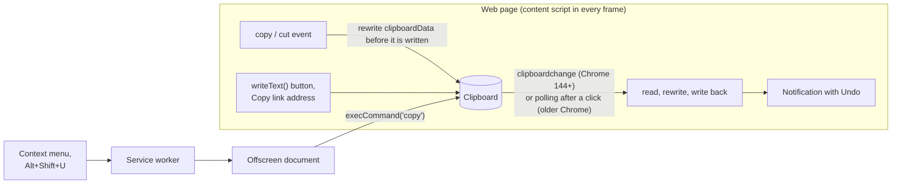

# UTM Randomizer

A Chrome extension that rewrites the tracking parameters in links you copy, so the links you share stop feeding someone's attribution reports. By default it swaps tracking values for nonsense (`utm_source=carrier-pigeon`); switch to Remove mode to delete them instead. Everything runs locally and the extension makes no network requests.

```text
Copied     https://example.com/article?id=42&utm_source=newsletter&utm_medium=email&fbclid=IwAR3xyz
Randomize  https://example.com/article?id=42&utm_source=carrier-pigeon&utm_medium=smoke-signals&fbclid=cookie-crumbler-mystery-tour-k3v9
Remove     https://example.com/article?id=42
```

## Install

Build from source (Node 22.13+ or 24):

```bash
git clone https://github.com/pszemraj/utm-randomizer.git
cd utm-randomizer
npm ci
npm run build
```

Open `chrome://extensions`, turn on **Developer mode**, click **Load unpacked**, and select the `dist/` folder (not the repository root). After pulling changes, run `npm run build` again and click the reload icon on the extension's card. Chrome 116 or newer is required; any Chromium-based browser with Manifest V3 support should work.

## Usage

Copy links the way you normally do. The extension catches:

- selecting a link and pressing Ctrl+C / ⌘C, including inside text fields;
- a site's own "Copy link" or "Share" button, whether it uses `navigator.clipboard`, `execCommand('copy')`, or a copy-event handler, including buttons inside iframes;
- right-click → **Copy link address**.

After a rewrite, a small notification appears in the bottom-left corner of the page with an **Undo** button that puts the original link back on the clipboard.

Three explicit actions copy a cleaned link on demand:

- right-click a link → **Copy link with tracking randomized** (**Copy link without tracking** in Remove mode);
- right-click a page → **Copy page link with tracking randomized**;
- press **Alt+Shift+U**, or click **Copy this page's link** in the toolbar popup, to copy the current page's address.

Copying straight from the address bar happens outside the page, where extensions cannot intercept it; use the shortcut or the popup button instead. The shortcut can be changed at `chrome://extensions/shortcuts`.

The toolbar popup also pauses automatic rewriting, switches between Randomize and Remove, turns notifications on or off, and shows how many links were cleaned in total and in the current browser session.

## What gets rewritten

Only parameters known to be tracking are touched, in two tiers:

- **Everywhere:** names that only ever mean tracking, such as `utm_*`, `gclid`, `gbraid`, `fbclid`, `msclkid`, `ttclid`, `twclid`, `li_fat_id`, `igsh`, `srsltid`, `gad_source`, `_gl`, Mailchimp's `mc_eid`, HubSpot's `_hsenc` and `__hstc`, Marketo's `mkt_tok`, Matomo's `pk_*` and `mtm_*`, and affiliate click IDs from Impact, CJ, Awin, and Rakuten.
- **On specific sites:** names that are functional elsewhere but tracking on a known site, such as `si` on YouTube and Spotify, `s` and `t` on X, `share_id` on Reddit, `rcm` and `trk*` on LinkedIn, `ref`, `qid`, and `pd_rd_*` on Amazon, `ved` and `ei` on Google Search, and `smid` on The New York Times.

Ambiguous names like `ref`, `source`, `src`, `campaign`, `keywords`, `cid`, and `session_id` are left alone everywhere else, because they carry real meaning on many sites: YouTube searches (`search_query`), LinkedIn job searches (`keywords`), Google Maps places (`cid`), and New York Times gift links (`unlocked_article_code`) all keep working. The complete list, with the sources it was curated from, is in [`src/lib/params.ts`](src/lib/params.ts).

Only the tracking values change. Parameter order, duplicate keys, percent-encoding, fragments, and scheme-less forms such as `www.example.com/page?utm_source=x` stay byte-for-byte identical. Values the extension generated itself are recognized, so copying an already-randomized link again, in the same tab or another, leaves it unchanged. When the clipboard holds longer text rather than a lone link, links inside it are rewritten only when the text came from a text field or from a site's own copy button; formatted text you select on a page is left as it is so its formatting survives.

## How it works

The content script runs in every frame of every http(s) page. The service worker owns the context menu, the shortcut, and the statistics.



Copy events (Ctrl+C, `execCommand('copy')`, and pages that fill `clipboardData` themselves) are rewritten synchronously, after the page's own handlers have run. Everything else is caught when the clipboard changes: Chrome 144 and later fire a `clipboardchange` event, and a change counts only if you clicked, typed, or right-clicked on that page within the previous 10 seconds, so links you copy in other apps are left alone. On older Chrome versions the content script instead checks the clipboard a few times during the seconds after a click on a button or link, or after a right-click on a link.

## Permissions

| Permission                          | Used for                                                                            |
| ----------------------------------- | ----------------------------------------------------------------------------------- |
| Content script on all http(s) pages | Detecting copies on any site                                                        |
| `clipboardRead`                     | Reading a link a page just copied, such as from a share button or Copy link address |
| `clipboardWrite`                    | Writing the rewritten link back                                                     |
| `contextMenus`                      | The "Copy link with tracking …" menu entries                                        |
| `offscreen`                         | Clipboard writes from the service worker, which has no page of its own              |
| `activeTab`                         | Reading the current tab's address when you use the shortcut, menu, or popup button  |
| `storage`                           | Settings and the rewrite counter                                                    |

Chrome summarizes these at install time as reading and changing data on all websites and reading and modifying data you copy and paste. See [PRIVACY.md](PRIVACY.md) for exactly what the extension does with that access.

## Development

```bash
npm run dev          # rebuild dist/ on every change, then reload the extension card
npm run check        # lint, format check, typecheck, unit tests
npm run test:e2e     # build, then run Playwright against the real extension in Chromium
npm run playground   # serve the manual test page at http://127.0.0.1:5173
npm run package      # build and zip dist/ into release/utm-randomizer-<version>.zip
npm run icons        # re-render assets/icons/*.png from assets/icon.svg
```

The end-to-end tests load `dist/` into Playwright's Chromium, copy links on a local test page through every path listed above, and read the clipboard back. Before the first run, install the browser with `npx playwright install chromium`, or set `CHROMIUM_PATH` to an existing Chromium binary. `HEADED=1` shows the browser while the tests run. Each test runs twice: once with the `clipboardchange` event enabled and once with it disabled, which exercises the polling fallback for older Chrome.

To try changes by hand, build and load `dist/`, run `npm run playground`, and open `http://127.0.0.1:5173`. The page has one control for each way sites copy links, links for right-click testing, look-alike functional links that must paste unchanged, an embedded iframe, and a box to paste into and inspect the result.

| Path                             | Contents                                                               |
| -------------------------------- | ---------------------------------------------------------------------- |
| `src/manifest.json`              | Extension manifest; the build fills in `version` from `package.json`   |
| `src/content.ts`                 | Content script entry: settings, copy watcher, notifications            |
| `src/background.ts`              | Service worker: context menu, shortcut, statistics, notification relay |
| `src/popup.*`, `src/offscreen.*` | Toolbar popup; clipboard writer for the service worker                 |
| `src/lib/params.ts`              | Tracking-parameter rules, global and per site                          |
| `src/lib/rewrite.ts`             | In-place link and text rewriting                                       |
| `src/lib/randomizer.ts`          | Replacement values and detection of already-randomized values          |
| `src/lib/copy-watcher.ts`        | Copy detection: copy events, `clipboardchange`, polling fallback       |
| `src/lib/toast.ts`               | On-page notification in a shadow root on the top layer                 |
| `tests/unit/`                    | Vitest: rules, rewriting, and the copy watcher in a simulated DOM      |
| `tests/e2e/`                     | Playwright tests with the extension loaded                             |
| `tests/fixtures/playground.html` | Manual and end-to-end test page                                        |
| `scripts/`                       | Build, packaging, playground server, icon renderer                     |

CI runs the checks, the end-to-end tests, and packaging on every pull request, and attaches the Web Store zip to the run. See [CONTRIBUTING.md](CONTRIBUTING.md) for adding parameters and submitting changes.

## License

MIT
