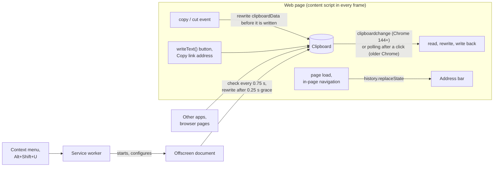

# UTM Randomizer

A Chrome extension that poisons link tracking. When you copy a link, or the page you are on has one in its address bar, it replaces the tracking values with believable decoys, so the links you share feed attribution reports with fake sources, campaigns, and click IDs that cannot be told apart from real ones. Silly mode uses obvious nonsense instead, Hybrid mode mixes the two value by value, and Remove mode deletes the parameters. Everything runs locally and the extension makes no network requests.

```text
Copied  https://example.com/article?id=42&utm_source=newsletter&utm_medium=email&utm_campaign=spring_sale&fbclid=IwAR3xYz123AbC456dEf789
Decoy   https://example.com/article?id=42&utm_source=outbrain&utm_medium=notification&utm_campaign=holiday_smb&fbclid=IwAR1hOl802PeN816eVz897
Silly   https://example.com/article?id=42&utm_source=a-very-confused-cat&utm_medium=shouting-really-loud&utm_campaign=operation-click-bait&fbclid=tracking-troll-the-utm-rebellion-in94ro
Hybrid  https://example.com/article?id=42&utm_source=a-very-confused-cat&utm_medium=notification&utm_campaign=operation-click-bait&fbclid=IwAR1hOl802PeN816eVz897
Remove  https://example.com/article?id=42
```

## Install

Build from source (Node 22.13+ or 24):

```bash
git clone https://github.com/pszemraj/utm-randomizer.git
cd utm-randomizer
npm ci
npm run build
```

Open `chrome://extensions`, turn on **Developer mode**, click **Load unpacked**, and select the `dist/` folder (not the repository root). After pulling changes, run `npm run build` again and click the reload icon on the extension's card. Chrome 116 or newer is required; any Chromium-based browser with Manifest V3 support should work.

## Usage

Copy links the way you normally do; there is nothing to click. Three layers catch them:

- **On web pages**, copies are rewritten the moment they happen: selecting a link and pressing Ctrl+C / ⌘C (including in text fields), a site's own "Copy link" or "Share" button (whether it uses `navigator.clipboard`, `execCommand('copy')`, or a copy-event handler, including inside iframes), and right-click → **Copy link address**.
- **In the address bar**, tracking parameters are replaced once the page has loaded and after every in-page navigation, without reloading. Copying the address, sharing the tab, bookmarking, and sending it to your phone all pick up the cleaned link.
- **Everywhere else**, a background watcher checks the clipboard about every 0.75 s and rewrites any tracked link that lands on it: copied in another app, on a browser page like `chrome://history`, or on a site where extensions cannot run.

After a rewrite, a small notification appears in the bottom-left corner of the page you are looking at, with an **Undo** button that puts the original link back and keeps it there.

Three explicit actions copy a cleaned link on demand: right-click a link → **Copy link with decoy tracking**; right-click a page → **Copy page link with decoy tracking**; and **Alt+Shift+U** or the popup's **Copy this page's link** button for the current page. The shortcut can be changed at `chrome://extensions/shortcuts`.

The toolbar popup switches between Decoy, Silly, Hybrid, and Remove, turns each layer and the notifications on or off, pauses everything automatic, and shows how many links were cleaned in total and in the current browser session.

## Replacement values

**Decoy** (the default) produces values that look exactly like real ones, so analysts cannot filter them out:

- sources and mediums from the vocabulary real campaigns use (`bing`, `linkedin`, `newsletter`, `paid_social`, `referral`, …);
- campaign names, search terms, and ad placements composed the way marketers write them (`retargeting_2024`, `black_friday_uk_2025`, `best+standing+desk`, `video_15s`);
- identifiers such as click IDs and share tokens rewritten character by character, keeping their exact length, alphabet, issuer prefix, separators, and percent-encoding (`IwAR3xYz…` stays a plausible `IwAR…` value, a 32-character hex `msclkid` stays 32 hex characters).

The values are derived from a random key created when the extension is installed plus the link itself. The same link always gets the same decoys on your browser, so rewriting is idempotent: copying an already-cleaned link, cleaning the address bar again, and the background watcher seeing a link a page already cleaned all leave it unchanged. Without your key, nobody can tell which values are decoys. Because a decoy never depends on the value it replaces, it occasionally matches it, most often for one-character values such as `gad_source=1`; the link is then already in its decoy form and is left as it is.

**Silly** uses obvious nonsense (`utm_source=carrier-pigeon`, click IDs as word salad). **Hybrid** picks a decoy or nonsense separately for each value, so one link can carry a believable click ID next to a joke source; the picks are seeded the same way, so a link keeps its mix. **Remove** deletes the tracking parameters.

## What gets rewritten

Only parameters known to be tracking are touched, in two tiers:

- **Everywhere:** names that only ever mean tracking, such as `utm_*`, `gclid`, `gbraid`, `fbclid`, `msclkid`, `ttclid`, `twclid`, `li_fat_id`, `igsh`, `srsltid`, `gad_source`, `_gl`, Mailchimp's `mc_eid`, HubSpot's `_hsenc` and `__hstc`, Marketo's `mkt_tok`, Matomo's `pk_*` and `mtm_*`, and affiliate click IDs from Impact, CJ, Awin, and Rakuten.
- **On specific sites:** names that are functional elsewhere but tracking on a known site, such as `si` on YouTube and Spotify, `s` and `t` on X, `share_id` on Reddit, `rcm` and `trk*` on LinkedIn, `ref`, `qid`, and `pd_rd_*` on Amazon, `ved` and `ei` on Google Search, and `smid` on The New York Times.

Ambiguous names like `ref`, `source`, `src`, `campaign`, `keywords`, `cid`, and `session_id` are left alone everywhere else, because they carry real meaning on many sites: YouTube searches (`search_query`), LinkedIn job searches (`keywords`), Google Maps places (`cid`), and New York Times gift links (`unlocked_article_code`) all keep working. The complete list, with the sources it was curated from, is in [`src/lib/params.ts`](src/lib/params.ts).

Only the tracking values change. Parameter order, duplicate keys, percent-encoding, fragments, and scheme-less forms such as `www.example.com/page?utm_source=x` stay byte-for-byte identical. When the clipboard holds longer text rather than a lone link, links inside it are rewritten only when the text is plain (from a text field, a site's copy button, or another app), including standalone Markdown links such as `[article](https://example.com/?utm_source=x)`; formatted text is left as it is so its formatting survives, and images and files on the clipboard are never touched.

## How it works



On web pages, copy events (Ctrl+C, `execCommand('copy')`, and pages that fill `clipboardData` themselves) are rewritten synchronously, after the page's own handlers have run. Other writes are caught when the clipboard changes: Chrome 144 and later fire a `clipboardchange` event, and a change counts only if you clicked, typed, or right-clicked on that page within the previous 10 seconds. On older Chrome versions the content script checks the clipboard a few times in the seconds after a click on a button or link, or after a right-click on a link.

The address bar is cleaned with `history.replaceState` once the page's `load` event has fired, so the page has already done its own work with the URL, and again 300 ms after each in-page navigation.

The background watcher runs in an offscreen document, because service workers have no DOM and offscreen documents are the only extension page that can read the clipboard without focus. When it sees new clipboard text containing a tracked link, it waits 250 ms so a page's content script can handle copies made on that page first, then rewrites what is left. Because rewriting is idempotent, the watcher and the content scripts never fight over a link. As a safety net against anything that disagrees, for 5 seconds after rewriting a link neither rewrites a different tracked version of it; copying the original link again still gets it rewritten. Undo tells the watcher to leave the restored link alone.

## Permissions

| Permission                          | Used for                                                                           |
| ----------------------------------- | ---------------------------------------------------------------------------------- |
| Content script on all http(s) pages | Detecting copies on any site and cleaning the address bar                          |
| `clipboardRead`                     | Reading a link a page just copied, and the background watcher's clipboard checks   |
| `clipboardWrite`                    | Writing the rewritten link back                                                    |
| `contextMenus`                      | The "Copy link with … tracking" menu entries                                       |
| `offscreen`                         | The background clipboard watcher, and clipboard writes from the service worker     |
| `activeTab`                         | Reading the current tab's address when you use the shortcut, menu, or popup button |
| `storage`                           | Settings, the rewrite counter, and the per-install key for decoys                  |

Chrome summarizes these at install time as reading and changing data on all websites and reading and modifying data you copy and paste. See [PRIVACY.md](PRIVACY.md) for exactly what the extension does with that access. Apple has announced, but not yet turned on by default, macOS prompts for apps that read the clipboard in the background; if your system ever asks whether Chrome may paste, that is the background watcher, and switching off **Watch the whole clipboard** stops it.

## Development

```bash
npm run dev          # rebuild dist/ on every change, then reload the extension card
npm run check        # lint (including required doc comments), format check, typecheck, unit tests
npm run test:e2e     # build, then run Playwright against the real extension in Chromium
npm run playground   # serve the manual test page at http://127.0.0.1:5173
npm run package      # build and zip dist/ into release/utm-randomizer-<version>.zip
npm run icons        # re-render assets/icons/*.png from assets/icon.svg
```

The end-to-end tests load `dist/` into Playwright's Chromium, copy links on a local test page through every path listed above, copy links from outside the page to exercise the background watcher, check the address bar, and read the clipboard back, including checks that the clipboard stays stable (no watcher ping-pong) and that Undo sticks. Before the first run, install the browser with `npx playwright install chromium`, or set `CHROMIUM_PATH` to an existing Chromium binary. `HEADED=1` shows the browser while the tests run. Each test runs twice: once with the `clipboardchange` event enabled and once with it disabled, which exercises the polling fallback for older Chrome.

To try changes by hand, build and load `dist/`, run `npm run playground`, and open `http://127.0.0.1:5173`. The page has one control for each way sites copy links, a link that reloads it with tracking parameters (watch the address bar), a tracked link to copy from another app, links for right-click testing, look-alike functional links that must paste unchanged, an embedded iframe, and a box to paste into and inspect the result.

| Path                             | Contents                                                                             |
| -------------------------------- | ------------------------------------------------------------------------------------ |
| `src/manifest.json`              | Extension manifest; the build fills in `version` from `package.json`                 |
| `src/content.ts`                 | Content script entry: settings, copy watcher, address bar, notifications             |
| `src/background.ts`              | Service worker: context menu, shortcut, statistics, key, clipboard watcher lifecycle |
| `src/offscreen.ts`               | Background clipboard watcher and clipboard writer                                    |
| `src/popup.*`                    | Toolbar popup                                                                        |
| `src/lib/params.ts`              | Tracking-parameter rules, global and per site                                        |
| `src/lib/rewrite.ts`             | In-place link and text rewriting                                                     |
| `src/lib/values.ts`, `prng.ts`   | Decoy, silly, and hybrid replacement values, seeded per install                      |
| `src/lib/copy-watcher.ts`        | Copy detection on pages: copy events, `clipboardchange`, polling fallback            |
| `src/lib/address-bar.ts`         | Address-bar cleaning                                                                 |
| `src/lib/toast.ts`               | On-page notification in a shadow root on the top layer                               |
| `tests/unit/`                    | Vitest: rules, rewriting, values, and the page watchers in a simulated DOM           |
| `tests/e2e/`                     | Playwright tests with the extension loaded                                           |
| `tests/fixtures/playground.html` | Manual and end-to-end test page                                                      |
| `scripts/`                       | Build, packaging, playground server, icon renderer                                   |

CI runs the checks, the end-to-end tests, and packaging on every pull request, and attaches the Web Store zip to the run. See [CONTRIBUTING.md](CONTRIBUTING.md) for adding parameters and replacement values and for submitting changes.

## License

MIT
